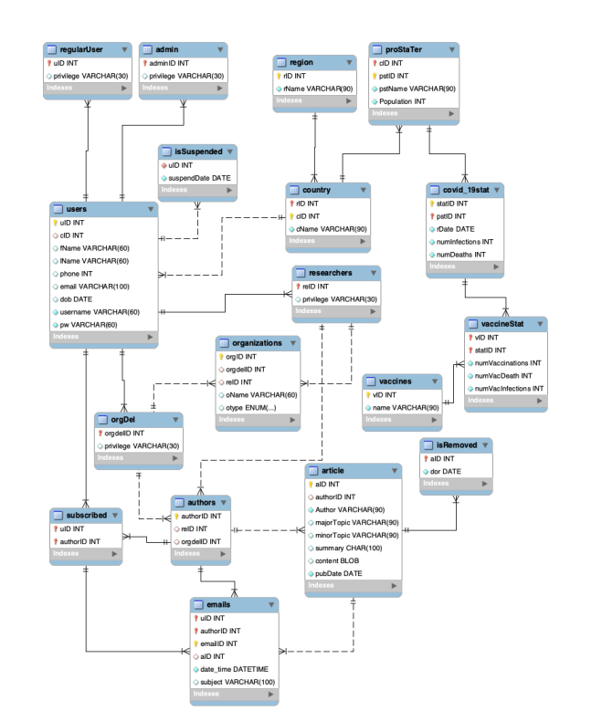

# Covid 19 Vaccination Database
Covid 19 Vaccination Database
Repository for class COMP353 at Concordia University.

Design and implementation of a Covid-19 vaccination database using sql.

Final Project:
 - Directory contains table creation, data insertion, and queries for the main project
 - Report attached illustrates the design process, sample queries and their results
 
 **Database Design**
 
 

"Warm-Up Project" contains table creation, data insertion, and queries for the for the initial warm-up project in the course

"front-end-db" contains HTML and PHP code used to build a simple GUI for the database, this is also stored on the ENCS web page assigned to our team

COMP 353 SUMMER 2022
